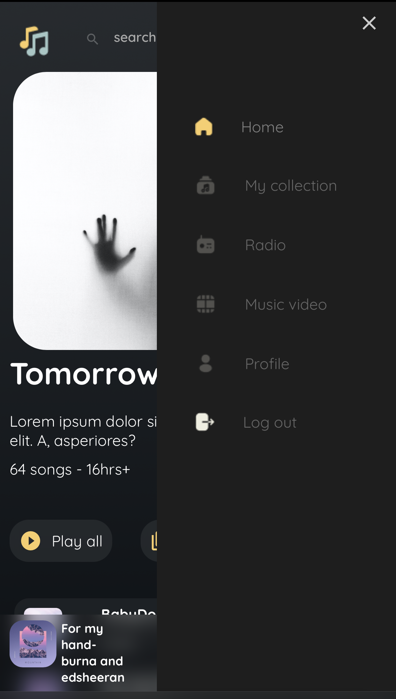
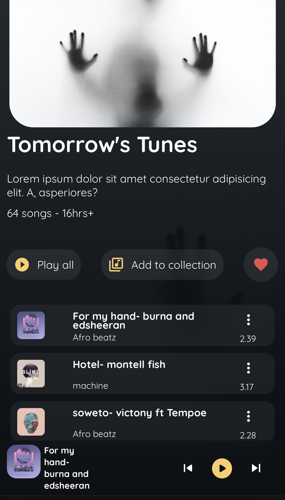
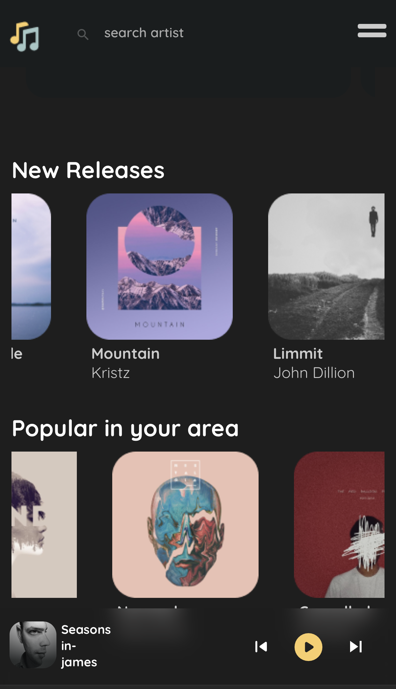

# Vader's Music App

## As the name implies, this is simply a music app designed without a single api call

# Description
This  project was born as a result of my love for music. i was scrolling through Twitter a couple of weeks ago and i came across a challenge coined as "November challenge for FrontEnd Developers" and this piqued my interest, you can't imagine how stimulated i felt when i found out it was about building a music app with a breathtaking UI(The UI was designed by the challenge creator,i guess), so i decided to take this challenge on and 'oh was it a challenge. After a couple of weeks i birthed something beyond my imagination, sometimes i manage to impress myself!.
Anyways, this design is not a full blown application as it has no BackEnd to it, hence i have only four songs stored on the app and it can be played, paused, skipped, returned, repeated etc. 
A pictorial representation of my finished App:

and why wouldnt it be mobile responsive,

# How to use
in order to acess the playlist, click on any of the topchats menu

it leads to the the next page containing the songs and then you can go ahead and have a melodious experience!

# Hosting link
This project is Hosted on Netlify, and can be visited here: [Vader's music App](https://vader-music-app.netlify.app/ "may the force be with you!")